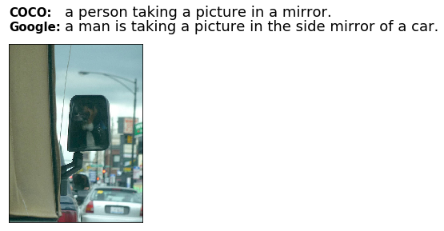
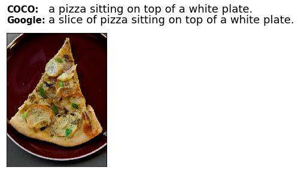

# NIC Wrapper
The NIC Wrapper is a framework that augments the training set of [Google NIC](https://github.com/tensorflow/models/tree/master/research/im2txt#contact)
, the deep-learning based Neural Image Caption Generator. NIC is built to validate a hypothesis that extra training data from [Google Image](https://images.google.com/)
 may help [Google NIC](https://github.com/tensorflow/models/tree/master/research/im2txt#contact)
  learn the [MS COCO](http://cocodataset.org/#home) dataset better.
  During the training process of NIC, we keep inserting image caption pairs from Google as extra training samples.
  By doing this, we expect the mistakes made by NIC are corrected. 
  
<!--- just 
### Contents
* [Overview](#overview)
* [Requirement](#requirement)
* [Installation](#installation)
* [References](#references)
* [Contact](#contact)
--->
### Overview
Suppose NIC sees an image of a "cat" and describe it as a "dog". If we use the term "dog"
to source extra images from Google and let NIC see the new images, NIC might
realize how a dog should look like. 
The NIC Wrapper automates this process. In each epoch of training, the wrapper sources extra training samples from Google, using the captions predicted by the latest model weights
  as textual queries. By keeps doing this, the model is expected to be more accurate since it has learned how Google binds images and captions.

The following diagram illustrates the model architecture.


We see a few decimal BLEU4 points of improvement when evaluating the NIC Wrapper on the
[MS COCO](http://cocodataset.org/#home) dataset. That is to say, the model trained with Google images has slightly better performances on the COCO validation. 
A few pairs of captions generated by the model trained with/without Google images are
seen below:
<!--- just 
COCO: a pizza sitting on top of a white plate .\n             |  COCO: a person taking a picture in a mirror .
Google: a slice of pizza sitting on top of a white plate .    |  Google: a man is taking a picture in the side mirror of a car .
--->


  


### Requirement

* **TensorFlow** 1.0 or greater ([instructions](https://www.tensorflow.org/install/))
* **NumPy** ([instructions](http://www.scipy.org/install.html))
* **Natural Language Toolkit (NLTK)**
    * First install NLTK ([instructions](http://www.nltk.org/install.html))
    * Then install the NLTK data ([instructions](http://www.nltk.org/data.html))
* **Icrawler** 0.3.6 or greater([instructions](https://github.com/hellock/icrawler))  

### Installation
Follow the steps at [im2txt](https://github.com/tensorflow/models/blob/master/research/im2txt/README.md) to get a whole picture of NIC.

Clone the repository:
```shell
git clone git@github.com:LEAAN/Source-new-samples-for-NIC.git
```

Prepare the COCO Data. This may take a few hours.
```shell
# Location to save the MSCOCO data.
MSCOCO_DIR="${HOME}/im2txt/data/mscoco"

# Build the preprocessing script.
sh /im2txt/data/download_and_preprocess_mscoco.py "${MSCOCO_DIR}"
```
Download the Inception v3 Checkpoint.
```shell
# Location to save the Inception v3 checkpoint.
INCEPTION_DIR="${HOME}/im2txt/data"
mkdir -p ${INCEPTION_DIR}

wget "http://download.tensorflow.org/models/inception_v3_2016_08_28.tar.gz"
tar -xvf "inception_v3_2016_08_28.tar.gz" -C ${INCEPTION_DIR}
rm "inception_v3_2016_08_28.tar.gz"
```
Train from scratch, only on COCO training set, until the LSTMs 
generate sentences that read like human languages. This takes around 
1 million steps, nearly one week using a TITAN X (Pascal) with 12 GB of GPU RAM.
```shell
# Directory containing preprocessed MSCOCO data.
MSCOCO_DIR="${HOME}/im2txt/data/mscoco"

# Inception v3 checkpoint file.
INCEPTION_CHECKPOINT="${HOME}/im2txt/data/inception_v3.ckpt"

# Directory to save the model.
MODEL_DIR="${HOME}/im2txt/model"

# Run the training script.
python /im2txt/train.py \
  --input_file_pattern="${MSCOCO_DIR}/train-?????-of-00256" \
  --inception_checkpoint_file="${INCEPTION_CHECKPOINT}" \
  --train_dir="${MODEL_DIR}/train" \
  --train_inception=false \
  --number_of_steps=1000000
```

Now that the captions generated by NIC already
read like human languages, we can feed the predicted
captions of COCO training images to Google. Images suggested by Google, together
with the textual queries used to source them, are added to the COCO training set.
We renew the image caption pairs from Google every epoch and allow
the latest model weights only see the extra training data obtained 
at the beginning of this epoch.

```shell
# save a backup of the model checkpoint at step=1,000,000
mkdir ${MODEL_DIR}/train_COCO
mv  ${MODEL_DIR}/train/* ${MODEL_DIR}/train_COCO/

# Train NIC with samples from Google.
python /im2txt/train_wrapper.py \
  --input_file_pattern="${MSCOCO_DIR}/train-?????-of-?????" \
  --train_dir="${MODEL_DIR}/train" \
  --train_inception=true \
  --number_of_steps=3000000
```
Run the image crawler in a separate process. 
```shell
# Ignore GPU devices 
export CUDA_VISIBLE_DEVICES=""

# Source image caption pairs from Google.
python /im2txt/data/build_google_data.py
```

We compare our performances to that of the model fine-tuned with only COCO. 

```shell
# move the checkpoints of the model trained with Google images to another directory.
mkdir ${MODEL_DIR}/train_Google
mv  ${MODEL_DIR}/train/!(1000000) ${MODEL_DIR}/train_Google/

# Restart the training script with --train_inception=true.
python /im2txt/train.py \
  --input_file_pattern="${MSCOCO_DIR}/train-?????-of-00256" \
  --train_dir="${MODEL_DIR}/train" \
  --train_inception=true \
  --number_of_steps=3000000
```

Calculate perplexity values while train_wrapper.py or train.py is running.
We evaluate the model by perplexity values during training. Since the perplexity value correlates to the loss value, we expect the perplexity on validating set decreases,
either trained with or without extra samples from Google. 
```shell
# Ignore GPU devices.
export CUDA_VISIBLE_DEVICES=""

# Run the evaluation script. This will run in a loop, periodically loading the
# latest model checkpoint file and computing evaluation metrics.
python /im2txt/evaluate.py \
  --input_file_pattern="${MSCOCO_DIR}/val-?????-of-00004" \
  --checkpoint_dir="${MODEL_DIR}/train" \
  --eval_dir="${MODEL_DIR}/eval"
```

Evaluation metrics including BLEU4 are calculated after the training is done.
An example of using the COCO evaluation API is available via https://github.com/tylin/coco-caption/blob/master/cocoEvalCapDemo.ipynb 

### References
[Show and Tell: Lessons learned from the 2015 MSCOCO Image Captioning Challenge](https://arxiv.org/abs/1609.06647)

[Microsoft COCO Captions: Data Collection and Evaluation Server](https://arxiv.org/abs/1504.00325)

<!--- just 
### Contact
Zitong Lian (LEAAN | lianzitong@yahoo.com)
--->


